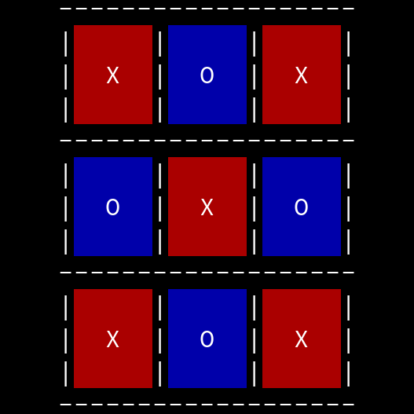
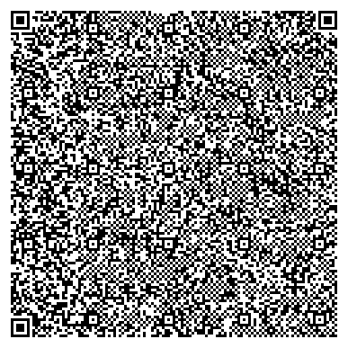

# BM-NAC
<sup>pronounced: bee-em-nack, stands for: beautiful-minimal-noughts-and-crosses</sup>

A noughts and crosses (tic-tac-toe) game for the Linux terminal written in assembly language, and designed to be both good-looking, and to produce a very small binary.

Produced for Hack Club's [saycheese YSWS](https://saycheese.hackclub.com/).



## Running

If you don't want to use the QR code, you can run it with:
```bash
nix run github:headblockhead/bm-nac
```

## QR Code

The binary is small enough to fit in a QR code, so here's that QR code!



Use `zbarimg --raw --oneshot -Sbinary qrcode.png > executable` to get the executable from the QR code.

## Tasks

> [!IMPORTANT]
> You must be in the `nix develop` shell for these tasks to work.

### build

```bash
nix build
ls -l ./result/bin/saycheese-ncg
```

### qr

```bash
qrencode -t ansiutf8 -8 -r result/bin/saycheese-ncg
qrencode -o qrcode.png -8 -r result/bin/saycheese-ncg
zbarimg --raw --oneshot -Sbinary qrcode.png > scanned-binary
diff -s result/bin/saycheese-ncg scanned-binary
```
